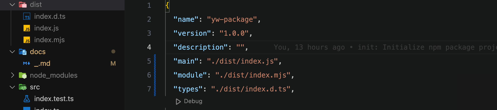

### init

`npm init --pnpm`

pnpm 장점

- node_modules 내부에 매번 패키지를 설치하지 않고,
- 글로벌 저장소에 패키지를 물리적으로 1번만 저장해 디스크 공간 절약, 성능 향상 도모

### scripts (dev, test, build, lint, ci)

tsup는 ts를 위한 차세대 번들러.

tsc로 lint 사용

for ci (vite 기반의 테스트 프레임워크) => `pnpm add -D vitest`

- test => `pnpm dev`, `pnpm test` (test는 quit까지 포함)

ci 명령어는 `pnpm run ci`에 구현(lint && test && build).

- workflows는 ts-reset 참고 (https://github.com/total-typescript/ts-reset/blob/main/.github/workflows/main.yml)
- github actions는 github Actions 탭에서 확인 가능.

### entrypoint

package.json에서 entrypoint 변경

- main entrypoint(`./dist/index.js`)에서 module(`./dist/index.mjs`)과 types(`./dist/index.d.ts`) 불러오는 구조

## References

[IMEF-FEMI/zod-message-bus](https://github.com/IMEF-FEMI/zod-message-bus/blob/main/tsconfig.json) 
