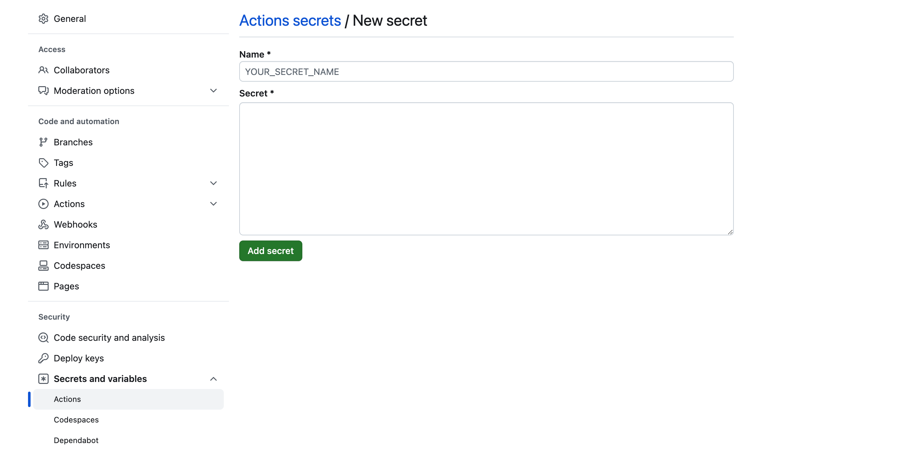
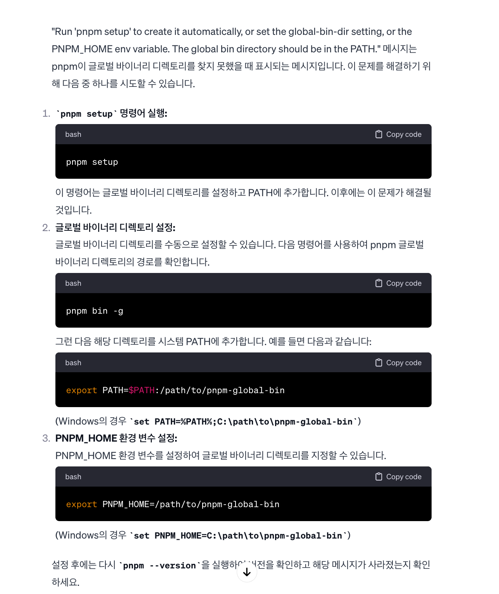

### init

`npm init --pnpm`

pnpm 장점

- node_modules 내부에 매번 패키지를 설치하지 않고,
- 글로벌 저장소에 패키지를 물리적으로 1번만 저장해 디스크 공간 절약, 성능 향상 도모

### scripts (dev, test, build, lint, ci)

tsup는 ts를 위한 차세대 번들러.

tsc로 lint 사용

for ci (vite 기반의 테스트 프레임워크) => `pnpm add -D vitest`

- test => `pnpm dev`, `pnpm test` (test는 quit까지 포함)

ci 명령어는 `pnpm run ci`에 구현(lint && test && build).

- workflows는 ts-reset 참고 (https://github.com/total-typescript/ts-reset/blob/main/.github/workflows/main.yml)
- github actions는 github Actions 탭에서 확인 가능.

### entrypoint

package.json에서 entrypoint 변경

- main entrypoint(`./dist/index.js`)에서 module(`./dist/index.mjs`)과 types(`./dist/index.d.ts`) 불러오는 구조


### npmjs

[npmjs](https://www.npmjs.com/)에서 회원가입 후 엑세스 토큰 발급.

- classic으로 발급 후, select type은 automation으로.

그리고 나서 github secret으로 npm 토큰을 등록한다.



### changeset

helps automate workflow for publishing

`pnpm add -D @changesets/cli` 설치 후

`pnpm changeset init`

.github/workflows/publish.yml 작성

package.json/scripts에서 release 추가 (for pnpm run release)

https://github.com/changesets/changesets/blob/main/docs/command-line-options.md#publish

그리고 나서 다시 `pnpm changeset`을 터미널에 입력해주고

- What kind of change is this for ywpackage에서 `patch` 선택
- summary: `Initial commit`으로 입력
- Is this your desired changeset? => `true`로 응답

++ 추가적으로 .nvmrc, vite.config.ts 파일 작성

이제 원격저장소에 push하면 이렇게 2개가 돌아감


### fail log 1

실패할텐데, 이유는 package.json에서 `"private": false,`를 추가해줘야 하기 때문임.<br>
.changeset/config.json에서도 `"access": "public",`로 변경.

remote: Permission to x.git denied to github-actions[bot].


workflow permissions를 `Read and write permissions`로 변경


`Allow Github Actions to create and approve pull request`로 체크


github actions이 성공하면 위와 같이 PR이 뜨므로 merge해준다.

merge가 성공하면 이렇게 npmjs에서 검색 가능!!


### .npmignore

npm에 굳이 올릴 필요 없는 것들을 무시해줍니다.

```json
// .npmignore

src
.changeset
.github
pnpm-lock.yaml
tsconfig.json
vite.config.ts
docs
```

이것보다 아래처럼 작성하는 게 더 좋음

```js
// .npmignore

*
!package.json
!dist/**/*
!CHANGELOG.md
!README.md
!LICENSE
```

다시 `pnpm changeset` > patch > "Fixed issue where dist folder was not being sent live"

그리고 나서 `pnpm changeset version`

이렇게 해야 npm에서 폴더를 확인했을 때 /dist가 정상적으로 보입니다.

### fail log

`pnpm i` 잘못했더니 pnpm 버전이랑 workflows 버전이랑 충돌나는 문제 있었음. 함부로 변경x

`pnpm i --frozen-lockfile`를 하면, pnpm-lock.yaml을 업데이트하지 않음.

pnpm 버전을 8로 올려야 될 것 같다.

`pnpm setup`을 입력해서 .zshrc에 path를 제대로 설정해주면 된다.



pnpm -v을 해서 8 이상인 걸 확인해주고, 다시 한번 node_modules 삭제후 `pnpm i --frozen-lockfile`로 lockfile을 유지한 채로 install을 진행하면 해결!

### zod 사용하기

`pnpm add -D zod`

그리고 나서 peerDependencies에도 zod를 작성해준다.

```js
// package.json
"peerDependencies": {
    "zod": "^3"
  },
```

이 패키지와 함께 설치되거나, 같이 쓰는 걸 추천한다는 의미를 갖는다.

처음에 로직을 구현하기 전에는 `declare const createMessageBus: any;` 이런식으로 declare로 선언해두고 코드를 작성하면 자연스럽다.

prettier도 설치<br>
`pnpm add -D prettier@2.8.4`

어느 정도 작성하고 테스트해볼 때는 `pnpm run ci`

테스트도 괜찮고, 패키지에 변경사항 올리고 싶으면 또 다시

```bash
pnpm changeset
이번엔 minor 선택 후
"Added createMessageProtocol API"로 메시지 입력

커밋까지 하고,
pnpm changeset version
그리고 해당 버전에 대한 커밋까지 추가 후 push origin
```

## References

[IMEF-FEMI/zod-message-bus](https://github.com/IMEF-FEMI/zod-message-bus/blob/main/tsconfig.json)<br>
[npm 에 내가 만든 패키지 배포하기 (feat. github action 으로 배포 자동화)](https://funveloper.tistory.com/204)<br>
